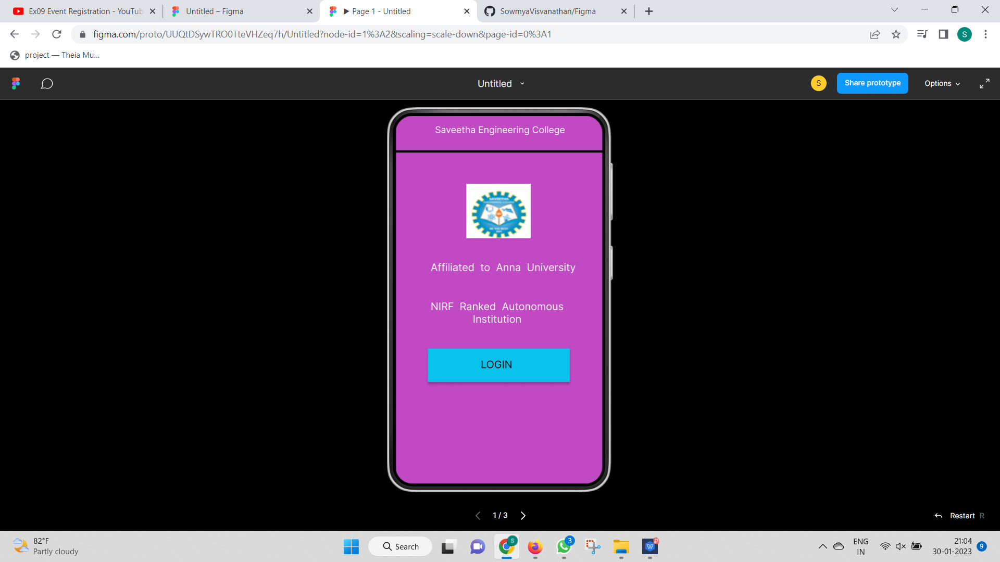

# Event Registration Web Application

## AIM:
To design, develop and deploy a web application for event registration.

## DESIGN STEPS:

### Step 1:
Create a new frame.

### Step 2:
Select any one preset size of your choice.

### Step 3:
Select the shapes you need.

### Step 4:
Import images as needed.

### Step 5:
Create pages based on your need and link them.

### Step 6:

Validate the HTML and CSS code.

### Step 6:

Publish the website in the given URL.

## DESIGN TOOL:
Figma

## CODE:
```
* home page */


position: relative;
width: 360px;
height: 640px;

background: #C149C4;


/* login page */


position: relative;
width: 360px;
height: 640px;

background: #D3A2FA;


/* SAVEETHA ENGINEERING COLLEGE */


position: absolute;
width: 313px;
height: 36px;
left: 23px;
top: 30px;

font-family: 'Inter';
font-style: normal;
font-weight: 400;
font-size: 16px;
line-height: 19px;

color: #000000;


/* Line 3 */


position: absolute;
width: 360px;
height: 0px;
left: 0px;
top: 74px;

border: 4px solid #000000;
transform: rotate(0.16deg);


/* image 3 */


position: absolute;
width: 112px;
height: 95px;
left: 112px;
top: 121px;

background: url(image.png);


/* DEPARTMENTS */


position: absolute;
width: 224px;
height: 38px;
left: 56px;
top: 271px;

font-family: 'Inter';
font-style: normal;
font-weight: 400;
font-size: 20px;
line-height: 24px;
text-align: center;

color: #000000;


/* AIML */


position: absolute;
width: 224px;
height: 38px;
left: 56px;
top: 355px;

font-family: 'Inter';
font-style: normal;
font-weight: 400;
font-size: 20px;
line-height: 24px;
text-align: center;

color: #000000;


/* AIDS */


position: absolute;
width: 224px;
height: 38px;
left: 56px;
top: 439px;

font-family: 'Inter';
font-style: normal;
font-weight: 400;
font-size: 20px;
line-height: 24px;
text-align: center;

color: #000000;


/* IOT */


position: absolute;
width: 224px;
height: 38px;
left: 56px;
top: 523px;

font-family: 'Inter';
font-style: normal;
font-weight: 400;
font-size: 20px;
line-height: 24px;
text-align: center;

color: #000000;
```
## OUTPUT:



## RESULT:
The program to design, develop and deploy a web application for event registration is completed successfully.